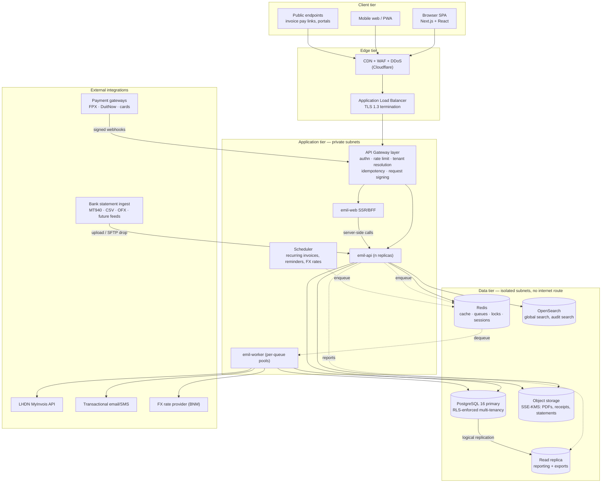
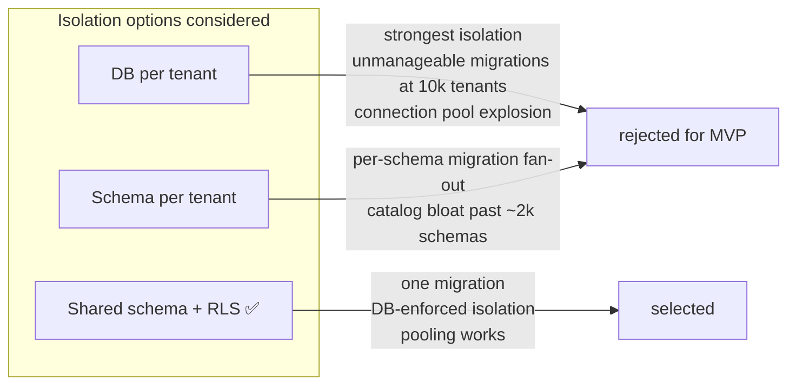

# 1. System Architecture

## 1.1 Architectural style: modular monolith with extracted async workers

Emil is deployed as **three runtime artefacts from one codebase**:

| Artefact | Responsibility | Scaling axis |
| --- | --- | --- |
| `emil-api` | Synchronous HTTP API — all read/write request handling | Horizontal, stateless, CPU/latency bound |
| `emil-worker` | Async jobs — MyInvois submission, PDF render, email, bank import parsing, report materialisation, recurring invoices | Horizontal per queue, IO bound |
| `emil-web` | Next.js server (SSR shell + BFF route handlers) | Horizontal, stateless |

Internally `emil-api` is partitioned into **domain modules** (`ledger`, `sales`, `purchases`, `banking`, `tax`, `einvoice`, `reporting`, `identity`) with enforced import boundaries. Modules communicate through published interfaces and an in-process domain event bus; they never reach into each other's tables. Cross-module reads go through a module's public query service.

**Why not microservices for the MVP:**

- A single invoice issuance touches the sequence allocator, the AR subledger, the tax engine, the general ledger, and the e-invoice outbox. In a monolith this is one `BEGIN … COMMIT`. In microservices it is a saga with compensating transactions — and a compensating transaction against a posted ledger is a reversing journal entry, which is a *real accounting event* the auditor will ask about. You would be manufacturing accounting noise to satisfy a deployment topology.
- Team size at MVP does not justify N deployment pipelines, N on-call surfaces, and distributed tracing as a prerequisite to debugging.
- The seams are preserved. `reporting` and `einvoice` are the two modules most likely to be extracted first; both are already async- and read-oriented.

**Extraction triggers (write these down now, act on them later):** reporting query load competing with transactional writes on the primary; e-invoice submission volume requiring independent scaling or a separate compliance-audited deployment; a second product line (payroll) with its own release cadence.

## 1.2 High-level topology



### Reading the diagram as layers

1. **Edge** — CDN caches static assets only. Never cache authenticated API responses at the edge. WAF applies OWASP core rules plus custom rules for the public payment-link endpoints, which are the only unauthenticated surface that touches tenant data.
2. **Gateway** — not a separate product at MVP; it is a middleware chain inside `emil-api` (auth → tenant resolution → RLS session binding → RBAC → rate limit → idempotency → audit context). A managed API gateway is introduced only when a second callable service exists. Keeping it in-process avoids a second place where tenant resolution can be wrong.
3. **Application** — fully stateless. Session state lives in Redis, files in object storage. Any replica can serve any request; a replica dying loses nothing.
4. **Data** — the primary database sits in a subnet with no route to the internet. Only the app tier's security group can reach port 5432. Reporting reads are routed to a replica so a heavyweight P&L drill-down cannot lock up invoice posting.

## 1.3 Request lifecycle (authenticated write)

```mermaid
sequenceDiagram
    autonumber
    participant U as Browser
    participant E as Edge/WAF
    participant G as Gateway middleware
    participant S as Domain service
    participant D as PostgreSQL
    participant Q as Redis queue
    participant W as Worker

    U->>E: POST /v1/invoices (JWT, Idempotency-Key, X-Tenant-Id)
    E->>G: forward (TLS 1.3, mTLS internal)
    G->>G: verify JWT signature + audience + expiry
    G->>G: resolve tenant; assert JWT tenant claim == header
    G->>G: RBAC check (permission: invoice.create)
    G->>G: idempotency lookup (Redis) — replay? return stored response
    G->>D: BEGIN; SET LOCAL app.tenant_id = $tenant
    Note over D: RLS policies now filter every table
    G->>S: dispatch to Sales module
    S->>D: allocate gapless invoice number (advisory lock)
    S->>D: insert invoice + line items
    S->>S: TaxEngine.compute(lines, tax_point_date)
    S->>D: insert journal_entry + journal_lines (balanced, deferred-check)
    S->>D: upsert account_period_balance rollups
    S->>D: insert outbox row (einvoice.submit, invoice.issued)
    S->>D: insert audit_log row (hash-chained)
    D-->>G: COMMIT
    G->>Q: relay outbox → queue (transactional outbox poller)
    G-->>U: 201 Created (+ store idempotent response)
    Q->>W: einvoice.submit job
    W->>W: build UBL 2.1 payload, sign, POST to MyInvois
    W->>D: update einvoice_submission status + LHDN UUID
    W-->>U: WebSocket/SSE push — compliance status changed
```

The two details that matter most:

- **`SET LOCAL app.tenant_id` inside the transaction.** `LOCAL` means it is scoped to the transaction and cannot leak to the next request served by the same pooled connection. This is the single point where multi-tenancy is enforced; treat any code path that opens a connection without it as a P0 defect and add a CI check for it.
- **Transactional outbox.** The e-invoice submission job is inserted in the *same transaction* as the invoice. If the commit fails, no job. If the commit succeeds, the job is guaranteed to exist even if Redis is down at that instant. Never enqueue directly from a request handler that also writes to the database.

## 1.4 Multi-tenancy model

**Chosen model: shared database, shared schema, `tenant_id` on every row, PostgreSQL RLS as the enforcement boundary.**



Implementation rules:

1. Every tenant-owned table has `tenant_id UUID NOT NULL` as the **first column of the primary key**: `PRIMARY KEY (tenant_id, id)`. Composite keys make it structurally impossible for a foreign key to point across tenants.
2. Every foreign key includes `tenant_id`: `FOREIGN KEY (tenant_id, customer_id) REFERENCES customer (tenant_id, id)`.
3. `ALTER TABLE … ENABLE ROW LEVEL SECURITY; FORCE ROW LEVEL SECURITY;` — `FORCE` also applies the policy to the table owner, closing the most common RLS bypass.
4. The application connects as a role **without** `BYPASSRLS`. Migrations use a separate, elevated role.
5. A migration test asserts that every table in the tenant schema has RLS enabled and a policy attached. New table without a policy = failing build.
6. **Escape hatch for enterprise/regulated clients:** the design permits promoting a single tenant to a dedicated database with zero code change, because the tenant ID resolution already sits behind a connection-routing layer. Sell this as a tier; do not build it in MVP.

**Noisy-neighbour control:** per-tenant rate limits at the gateway, per-tenant queue concurrency caps in the worker, statement timeouts on the reporting replica, and a background job budget so one tenant's 200k-row CSV import cannot starve everyone else's invoice emails.

## 1.5 Secure interaction between tiers

| Boundary | Control |
| --- | --- |
| Browser → Edge | TLS 1.3 only, HSTS with preload, strict CSP, `Secure`/`HttpOnly`/`SameSite=Lax` cookies |
| Browser → API auth | Short-lived (10 min) access JWT in memory; refresh token as HttpOnly cookie bound to device fingerprint; rotation with reuse detection |
| Edge → App | Private network only; ALB security group is the sole ingress to app SGs |
| App → App | mTLS inside the mesh/VPC; no service reachable from the public internet |
| App → PostgreSQL | TLS required, IAM-based or Secrets-Manager-rotated credentials, no long-lived static passwords in env vars |
| App → Object storage | Pre-signed URLs, short TTL, tenant-scoped key prefixes, SSE-KMS with a per-tenant data key |
| App → LHDN/PayNet | Outbound via NAT with fixed egress IPs (many financial partners require IP allowlisting); client certs / signed payloads held in KMS |
| Inbound webhooks | HMAC signature verification, replay-window check, and the handler is idempotent by provider event ID |

## 1.6 Performance architecture

Reports are the read-heavy hot path and the reason naive accounting apps get slow at year two.

**Balance rollup strategy.** Do not compute a trial balance by scanning `journal_line`. Maintain `account_period_balance (tenant_id, account_id, fiscal_period_id, currency, debit_total, credit_total, closing_balance)`, updated inside the posting transaction. Consequences:

- Trial balance = one indexed read per account per period.
- SOPL/SOFP = aggregation over a few hundred rollup rows, not millions of lines.
- A nightly **integrity job** recomputes rollups from raw journal lines and alerts on any drift. This is your canary for a posting bug — and if the rollup is ever wrong, the raw journal is the source of truth and the rollup is rebuilt from it.

**Other measures:** cursor pagination (never `OFFSET` on large lists); partial indexes for hot filters (`WHERE status = 'AWAITING_PAYMENT'`); `BRIN` indexes on date columns of large append-only tables; reporting reads pinned to the replica with a statement timeout; per-tenant Redis cache for chart of accounts, tax rates and FX with explicit invalidation on write; PDF generation and large exports always async with a download-ready notification.

**Targets (p95, at 5M journal lines / tenant):** invoice list ≤ 300 ms · invoice create ≤ 500 ms · trial balance ≤ 800 ms · SOPL/SOFP ≤ 1.5 s · bank match suggestions for a 500-line statement ≤ 3 s.

## 1.7 Environments and data flow discipline

`local` → `ci` → `staging` → `production`, with:

- **No production data in lower environments.** Ever. Use a synthetic Malaysian dataset generator (SSM-format registration numbers, TIN formats, realistic SST mixes) so staging exercises the real edge cases without real personal data.
- Infrastructure as code (Terraform) — environments differ only by variable file.
- Migrations are forward-only, expand/contract, and run as a separate pipeline step before the app deploys.
- Production database access by humans requires break-glass approval, is time-bounded, and is session-recorded.
