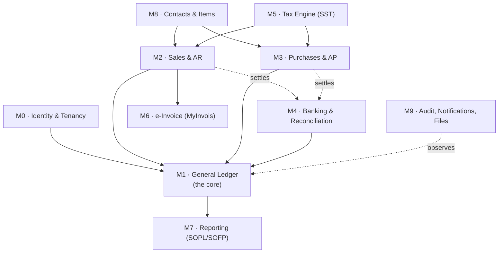

# 2. Core Modules Breakdown (MVP)

Ten modules. Each section gives **Purpose**, **Key Features**, **Data Models**, and **Boundary notes** (what the module owns, what it must not touch).

**The dependency rule:** everything posts *into* the General Ledger; nothing reads *out* of another module's tables. M1 has no outbound dependencies on M2–M6. If you ever find `sales` importing from `banking`, you have a design bug — route it through a domain event or a published query interface.

---

## M0 · Identity, Tenancy & Access Control

**Purpose.** Establish who the user is, which organisations they may act for, and what they may do inside each. This is also where the accountant-with-many-clients model lives, which is a primary differentiator for the freelance-accountant segment.

**Key features**
- Email + password (Argon2id) and Google/Microsoft SSO; TOTP MFA, mandatory for `Owner`/`Admin` roles
- Organisation (tenant) creation with a Malaysian onboarding wizard: SSM registration number, TIN, MSIC code, SST registration status, financial year end, MPERS vs MFRS reporting framework, base currency defaulted to **MYR (RM)**
- **Multi-org switcher** — one user account, N client organisations, instant context switch without re-login
- Role-based access control with a fixed role set and per-org assignment: `Owner`, `Admin`, `Accountant`, `Bookkeeper`, `Sales`, `Approver`, `Read-only`, `External Auditor` (time-boxed, read-only, all activity logged)
- Invitation flow with expiring tokens; seat management; forced re-auth for sensitive actions (bank details change, period lock, user role change)
- Session management: list active sessions, revoke a device, IP/device change alerts
- API keys and OAuth2 clients for third-party integrations, scoped per organisation with least-privilege scopes

**Data models**

| Entity | Notes |
| --- | --- |
| `User` | Global identity: email, password_hash, mfa_secret, status, last_login_at |
| `Organisation` | The tenant. name, ssm_registration_no, tin, msic_code, sst_registered, sst_no, fye_month, reporting_framework, base_currency (`MYR`), timezone (`Asia/Kuala_Lumpur`), locale |
| `Membership` | (user_id, organisation_id, role, status, invited_by, joined_at) — the many-to-many that makes multi-client work |
| `Role` / `Permission` / `RolePermission` | Permissions as fine-grained strings (`invoice.create`, `journal.post`, `period.lock`, `bank.reconcile`) |
| `Invitation` | token_hash, email, role, expires_at, accepted_at |
| `Session` | refresh_token_hash, device_fingerprint, ip, user_agent, revoked_at |
| `ApiKey` | prefix, key_hash, scopes[], last_used_at, expires_at |

**Implementation status.** Built: users, memberships, the eight-role permission matrix, refresh-token
rotation with reuse detection, API keys, and `financial_event_log` — which **completes ledger
invariant #9**. The NestJS API in `apps/api` exposes the whole system over HTTP.

Four decisions worth knowing:

- **Identity is GLOBAL and has no RLS policy** — because it cannot have one. A user spans
  organisations by design, and authentication runs before any tenant is known. The mitigation is
  stronger than a policy rather than weaker: the application role has **no grant at all** on
  `app_user` and `user_session`, and every pre-tenant operation goes through a narrow
  SECURITY DEFINER function. `rls.test.ts` asserts the absence of that grant, so it is a checked
  property rather than a comment.
- **`membership` carries the one policy that differs from every other table**:
  `tenant_id = current_tenant_id() OR user_id = current_user_id()`. The organisation switcher has to
  ask "which tenants may I act for", and that question has no tenant context by definition. It
  widens visibility by exactly the caller's own rows and nothing more.
- **Refresh-token reuse revokes the whole family**, not the presented token. When a spent token is
  replayed, two parties hold copies and there is no way to tell the thief from the victim — revoking
  only the presented one leaves a thief who refreshed first holding a live session, which is the
  attack. The service returns a result rather than throwing, so the revocation **commits**; an
  earlier version threw from inside the transaction and rolled back its own security response.
- **RBAC is a guard, not an RLS policy.** RLS answers "may this connection see this tenant at all"
  and is enforced by PostgreSQL; RBAC answers "may this member perform this action inside a tenant
  they already belong to". An RBAC bug leaks within one tenant — bad, but bounded. An RLS bug leaks
  across tenants. That asymmetry is why the boundary is the one the database enforces.

**Deferred within M0**, stated rather than implied: SSO, MFA/TOTP (the column exists; the flow does
not), OAuth2 clients, invitation email delivery, and Redis-backed rate limiting.

**Boundary notes.** M0 is the only module that may write `Organisation`. It publishes `TenantContext` (tenant_id, user_id, permissions) which the gateway middleware attaches to every request. Domain modules receive it; they never re-derive it.

---

## M1 · General Ledger & Chart of Accounts *(the core — build this first)*

**Purpose.** The double-entry engine. Every financial fact in the system ends up here as a balanced journal entry. This module's correctness is the product's correctness; everything else is a user interface over it.

**Key features**
- **Chart of Accounts** with Malaysian SME templates per industry (trading, services, F&B, construction, professional practice), each pre-mapped to MPERS-compliant SOPL/SOFP line items
- Account hierarchy (parent/child), account types (`ASSET`, `LIABILITY`, `EQUITY`, `INCOME`, `EXPENSE`), system accounts that cannot be deleted (AR control, AP control, SST payable/claimable, retained earnings, FX gain/loss, rounding, suspense)
- **Manual journal entries** with draft → approved → posted workflow; attachment support; recurring journals (accruals, prepayments, depreciation)
- **Immutability:** posted entries are never edited or deleted. Corrections are *reversing entries* that reference the original. A DB trigger raises on `UPDATE`/`DELETE` of a posted entry.
- **Balanced-by-construction:** a deferred constraint trigger asserts `SUM(debit) = SUM(credit)` per entry at COMMIT, per currency
- **Fiscal periods** — open/closed/locked; posting into a locked period requires an explicit permission and is separately audit-flagged; a hard lock after statutory filing
- **Year-end close:** roll income and expense accounts into retained earnings, generate the closing entry, open the new year
- **Multi-currency:** transaction currency + base currency (RM) amounts on every line; daily rates (BNM as the reference source); automatic realised FX gain/loss on settlement and unrealised revaluation at period end
- Opening balance import for migrating tenants (from Xero, SQL Account, AutoCount, UBS — the actual Malaysian incumbents)

**Data models**

| Entity | Key fields |
| --- | --- |
| `Account` | tenant_id, code, name, type, subtype, parent_id, currency, is_system, is_active, tax_default_id, sopl_sofp_mapping |
| `JournalEntry` | tenant_id, entry_no, entry_date, fiscal_period_id, description, source_module, source_document_type, source_document_id, status (`DRAFT`/`POSTED`/`REVERSED`), reversal_of_id, posted_by, posted_at |
| `JournalLine` | tenant_id, journal_entry_id, line_no, account_id, debit, credit, currency, fx_rate, base_debit, base_credit, description, contact_id, tax_code_id, tracking_category_id |
| `FiscalYear` / `FiscalPeriod` | start_date, end_date, status (`OPEN`/`CLOSED`/`LOCKED`), locked_by, locked_at |
| `AccountPeriodBalance` | tenant_id, account_id, fiscal_period_id, currency, opening, debit_total, credit_total, closing — **the rollup that makes reports fast** |
| `ExchangeRate` | currency_from, currency_to, rate_date, rate, source |
| `TrackingCategory` / `TrackingOption` | Xero-style dimensions (department, branch, project) — one dimension in MVP, two later |
| `NumberSequence` | tenant_id, document_type, prefix, next_value, padding — gapless allocation under advisory lock |

**Boundary notes.** M1 exposes exactly one write API to other modules: `LedgerService.post(JournalEntryDraft, IdempotencyKey) -> PostedEntry`. Nothing outside M1 writes to `journal_entry`, `journal_line`, or `account_period_balance`. This one rule is what keeps the ledger trustworthy.

---

## M2 · Sales & Accounts Receivable

**Purpose.** From quote to cash: issue sales documents, track what customers owe, apply receipts, and keep AR in agreement with the GL control account at all times.

**Key features**
- **Quotes** → **Sales Orders** (optional) → **Invoices** → **Credit Notes**; each conversion carries lines forward
- **Recurring invoices**: schedule (daily/weekly/monthly/quarterly/annual), end condition, auto-issue or draft-for-review, placeholder substitution (period, month name), auto-send on issue
- **Payment reminders**: configurable cadence (e.g. 3 days before due, on due date, +7, +14, +30), per-customer opt-out, escalating templates, batch statement-of-account send
- **Online payment links** on invoice PDFs and emails — FPX, DuitNow QR, DuitNow Transfer, cards; public tokenised pay page with no login
- Part payments, overpayments, prepayments/deposits, customer credit application, write-off to bad debt with the correct SST adjustment treatment
- Batch actions: bulk issue, bulk send, bulk PDF export for the auditor
- Branded invoice templates (logo, colours, terms, bank details, signature), PDF + embedded MyInvois QR once validated
- Aged receivables (30/60/90/120+), customer statements, credit limit warnings, DSO metric
- **Automatic GL posting** — issue: `Dr AR / Cr Revenue / Cr SST Payable`; receipt: `Dr Bank (or Undeposited Funds) / Cr AR`; FX settlement difference to realised gain/loss

**Data models**

| Entity | Key fields |
| --- | --- |
| `Invoice` | tenant_id, invoice_no, customer_id, issue_date, due_date, currency, fx_rate, subtotal, tax_total, rounding_adjustment, total, amount_paid, amount_due, status (`DRAFT`/`AWAITING_APPROVAL`/`ISSUED`/`PART_PAID`/`PAID`/`OVERDUE`/`VOIDED`), journal_entry_id, einvoice_submission_id, reference, terms |
| `InvoiceLineItem` | invoice_id, line_no, item_id, description, quantity, unit_price, discount_pct, discount_amount, account_id, tax_code_id, tax_amount, line_total, tracking_option_id, **classification_code** (MyInvois requirement) |
| `Quote` / `QuoteLineItem` | mirrors invoice; converts to invoice |
| `CreditNote` / `CreditNoteLineItem` | credit_note_no, invoice_id (optional), reason_code, allocation state |
| `Payment` | tenant_id, payment_no, contact_id, payment_date, method (`FPX`/`DUITNOW`/`CARD`/`CHEQUE`/`CASH`/`TRANSFER`), bank_account_id, currency, amount, reference, gateway_txn_id, journal_entry_id |
| `PaymentAllocation` | payment_id, target_type (`INVOICE`/`CREDIT_NOTE`/`PREPAYMENT`), target_id, amount_allocated — many-to-many so one receipt can settle several invoices |
| `RecurringInvoiceTemplate` | schedule_rule, next_run_date, end_date, auto_send, template payload |
| `ReminderRule` / `ReminderLog` | offset_days, template_id, channel, sent_at, opened_at |

**Boundary notes.** M2 calls M5 for tax, M6 for e-invoice submission (async), M1 to post. It never writes bank transactions directly — a receipt creates a `Payment`, and M4 matches it to the bank line.

---

## M3 · Purchases & Accounts Payable

**Purpose.** The mirror of M2 for money going out, plus the receipt-capture workflow that SMEs actually judge accounting software on.

**Key features**
- **Purchase Orders** → **Bills** → **Debit Notes**; three-way match (PO / goods received / bill) as an optional control
- **Bill approval workflow** with amount-threshold routing (e.g. > RM10,000 requires a second approver) and full approval audit trail
- **Receipt & bill capture**: mobile/email upload to a per-tenant inbox address, OCR extraction of supplier, date, amount, tax, and line items, with human confirm-before-post. Never auto-post OCR output — extraction confidence must be surfaced and reviewed.
- Expense claims for employees with reimbursement runs
- Supplier ageing, payment scheduling, batch payment file export (bank-specific bulk payment formats for Maybank/CIMB/Public Bank), remittance advice emails
- **Self-billed e-invoice** handling for foreign suppliers and specified transaction types — a MyInvois requirement that generic products handle badly
- Withholding tax on payments to non-residents, computed and tracked for the CP37 series
- **Automatic GL posting** — bill: `Dr Expense/Asset / Dr SST Claimable / Cr AP`; payment: `Dr AP / Cr Bank`

**Data models**

| Entity | Key fields |
| --- | --- |
| `Bill` | tenant_id, bill_no (supplier's), internal_ref, supplier_id, bill_date, due_date, currency, fx_rate, subtotal, tax_total, total, amount_paid, status, journal_entry_id, approval_status, attachment_ids[] |
| `BillLineItem` | bill_id, description, quantity, unit_price, account_id, tax_code_id, tax_amount, line_total, tracking_option_id |
| `PurchaseOrder` / `PurchaseOrderLineItem` | po_no, expected_date, status, received_qty per line |
| `DebitNote` / `DebitNoteLineItem` | supplier credit against a bill |
| `SupplierPayment` | reuses `Payment` + `PaymentAllocation` with direction = `OUTBOUND` |
| `ExpenseClaim` / `ExpenseClaimLine` | employee_id, status, reimbursed_payment_id |
| `ApprovalRule` / `ApprovalRequest` | threshold, approver_role, sequence, decision, decided_at, comment |
| `DocumentCapture` | file_id, ocr_status, extracted_json, confidence_scores, review_status, created_bill_id |

**Implementation status.** Bills, supplier payments, debit notes, AP ageing, AP revaluation and the
withholding *mechanism* are built (`packages/db/migrations/0010_purchases.sql`,
`packages/db/src/bill.ts`, `supplier-payment.ts`, `debit-note.ts`). Four decisions worth knowing
before extending this module:

- **`bill_no` is UNIQUE per `(tenant_id, supplier_id)`, never per tenant.** It is the supplier's
  own number. Two suppliers both using `INV-001` is normal; a tenant-wide unique index rejects the
  second one, which surfaces as a customer who cannot enter a bill. Our gapless identifier is
  `internal_ref`, allocated through `allocate_document_number('BILL')`.
- **`payment_allocation` is an exclusive arc, not a polymorphic key** — nullable `invoice_id` and
  `bill_id`, each with a real composite foreign key, plus
  `CHECK (num_nonnulls(invoice_id, bill_id) = 1)`. Referential integrity survives on both arms.
- **Withholding discharges the payable at the GROSS.** `Dr AP gross / Cr Bank net / Cr WHT payable
  withheld`. Debiting only the net would leave the bill permanently part-paid and break ledger
  invariant #7 forever.
- **`wht_rate` ships EMPTY, and that is not an oversight.** Malaysian withholding rates depend on
  the payment type and on any applicable double taxation agreement; they must be verified against
  LHDN. A payment that asks to withhold with no configured rate fails loudly rather than
  withholding zero, because the payer carries the liability for under-withholding.

**Bill approval is now built** (`0013_bill_approval.sql`, `packages/domain/src/approval.ts`,
`packages/db/src/approval.ts`), having waited for M0 as planned. Two decisions define it:

- **Approval gates PAYMENT, not recognition.** The tempting design holds a bill out of the ledger
  until approved, and it produces a misstatement rather than an inconvenience: if the goods arrived
  and the supplier has invoiced, the obligation EXISTS, and accrual accounting recognises it when
  incurred. A bill held back understates payables and expenses — worst at period end, when
  unapproved bills pile up. So a bill posts on entry and `paySupplier()` refuses to release cash.
- **Separation of duties is enforced in the database as well as the domain.** The requester can
  never approve their own bill (a trigger), and one person can never fill two steps (a UNIQUE on
  `(request, decided_by)`). "Over RM 10,000 needs a second approver" means a second PERSON — at a
  small company one user often holds both roles, and allowing it defeats the threshold entirely. A
  control that lives only in application code is one a script or a bulk import walks around.

The routing rules in force are **snapshot into the request**, not referenced. Raising a threshold
later must not make a past approval look unnecessary, nor lowering one make it look insufficient.

**Deferred within M3**, stated rather than implied: purchase orders and three-way match, OCR
document capture, expense claims, batch payment file export, self-billed e-invoice generation, and
the WHT rates plus CP37 filing artefacts.

---

## M4 · Banking & Reconciliation

**Purpose.** Get bank reality into the system and prove that the book balance equals the bank balance. In Malaysia this is import-driven, because broad open-banking APIs are not yet available — design for import first and treat feeds as a pluggable adapter.

**Key features**
- Bank/cash/credit-card/e-wallet accounts, each mapped to a GL account
- **Statement import**: CSV with a saved per-bank column mapping profile, MT940, OFX/QIF, plus PDF-statement parsing as a best-effort convenience. Ship mapping profiles for Maybank, CIMB, Public Bank, RHB, Hong Leong, Bank Islam, Ambank, OCBC, HSBC, UOB.
- **Duplicate detection** on import (hash of date + amount + description + running balance) so re-uploading an overlapping statement is safe
- **Reconciliation workspace** — the signature screen: bank lines on the left, suggested matches on the right, one-click accept, split, or create-transaction-from-line
- **Matching engine** (see the worked prompt in `07-prompt-engineering-guidelines.md`): exact amount+date, amount within tolerance and date within a window, reference/invoice-number extraction from the narrative, contact-name fuzzy match, one-to-many and many-to-one grouping, learned rules from prior user decisions
- **Bank rules**: "if description contains TNB then code to Utilities, tax code SST-exempt, contact Tenaga Nasional" — evaluated in priority order, auto-applied or suggest-only
- Unreconciled-item ageing, reconciliation reports per period, and a **lock** on a reconciled period so the underlying transactions cannot be silently altered
- Transfers between own accounts recognised as a single event, not two unrelated lines
- Adapter interface `BankFeedProvider` so a future DuitNow/PayNet or aggregator feed drops in without touching the reconciliation UI

**Data models**

| Entity | Key fields |
| --- | --- |
| `BankAccount` | tenant_id, name, bank_name, account_no_masked, swift, currency, gl_account_id, opening_balance, current_book_balance, feed_provider |
| `BankStatement` | bank_account_id, statement_date, opening_balance, closing_balance, source (`CSV`/`MT940`/`OFX`/`FEED`), file_id, imported_by, line_count |
| `BankTransaction` | tenant_id, bank_account_id, statement_id, txn_date, value_date, description, reference, amount (signed), running_balance, dedupe_hash, status (`UNRECONCILED`/`MATCHED`/`RECONCILED`/`EXCLUDED`) |
| `ReconciliationMatch` | bank_transaction_id, matched_type (`PAYMENT`/`INVOICE`/`BILL`/`JOURNAL`/`TRANSFER`), matched_id, amount, confidence_score, match_method (`AUTO`/`RULE`/`MANUAL`), matched_by, matched_at |
| `BankRule` | priority, conditions_json, actions_json, auto_apply, hit_count |
| `ReconciliationSession` | bank_account_id, period_start, period_end, statement_closing_balance, book_closing_balance, variance, status, completed_by, completed_at |
| `ImportProfile` | bank_name, delimiter, date_format, column_map_json, amount_convention (single signed column vs debit/credit columns) |

**Implementation status.** Built: bank accounts, profile-driven CSV import with de-duplication, the
matching engine (`packages/domain/src/matching.ts`, all seven acceptance tests from §7.4 including
the 500 × 2,000 performance budget), transfer detection, bank rules, confirm/unmatch, creating a
ledger entry from a statement line, the reconciliation statement and sessions. **Closes ledger
invariant #8.**

Decisions worth knowing before extending this module:

- **Saved profiles, never dialect sniffing.** Guessing a CSV's shape is right most of the time and
  silent when wrong: a description column read as an amount imports a plausible statement with wrong
  numbers, and the user finds out at year end. Profiles are explicit per bank, parsing is total
  (violations are returned, never thrown), and `previewStatement()` shows the result before anything
  is written — so a wrong profile fails in front of the person who can fix it.
- **De-duplication is `(date, amount, narrative, running balance)` plus an occurrence ordinal**, and
  it is enforced by a unique index rather than by checking before inserting. The running balance is
  in the key because two RM 50 ATM withdrawals on one day with one narrative are two real events,
  and a naive hash drops the second — understating the bank with no error anywhere. The ordinal is
  the fallback for banks that publish no running balance; its limitation is that a re-import
  beginning part-way through a run of identical rows will re-import one, which is visible in the
  preview rather than silent.
- **Unmatching inserts a reversal row**, exactly as a posted entry is corrected by a reversing
  entry. `active_reconciliation_match` is the view everything reads; the base table holds decisions,
  including undone ones.
- **The view is `WITH (security_invoker = true)`**, without which it would execute as its owner and
  return every tenant's rows. The table sweep in `rls.test.ts` walks `relkind = 'r'` and cannot
  catch that, so views are checked separately and by property.
- **Suggestions only.** Confidence 100 still requires a click, and `auto_apply` on a bank rule is
  per rule and off by default.

**Deferred within M4**, stated rather than implied: MT940, OFX/QIF and PDF statement parsing; live
bank feeds (the `BankFeedProvider` port only, with no adapter — a speculative client written against
an aggregator nobody has integrated would look finished and be wrong); learned rules derived from
user corrections beyond the narrative→contact aliases already fed to the matcher; and the
reconciliation workspace UI.

**Boundary notes.** A match never rewrites history. Accepting a match creates a `ReconciliationMatch` row and flips a status; it does not edit the posted journal entry. Unmatching creates a new row with the reversal, so the audit trail shows both decisions.

---

## M5 · Tax Engine (SST + withholding)

**Purpose.** One place that answers "what tax applies to this line, at this date, for this entity" — so no other module ever hardcodes a rate.

**Key features**
- **Effective-dated, versioned tax codes.** A rate change is a new version row with a validity window; a 2024 invoice reprints with the 2024 rate forever.
- Sales tax and service tax handled as distinct regimes with distinct rates, taxable-person rules, and exemption certificates
- Tax-inclusive and tax-exclusive line entry, with a documented rounding policy (round at line level vs document level is a decision that changes cents — pick one, write it down, test it)
- Exemption handling: zero-rated, exempt, out-of-scope, and exemption-certificate tracking per customer
- Reverse charge / imported services handling
- Withholding tax rules per payment type and recipient residency
- **SST return preparation** (SST-02 shaped) with a drill-down from each box to the contributing transactions — the drill-down is what accountants trust
- Tax audit file / transaction-level tax listing export

**Data models**

| Entity | Key fields |
| --- | --- |
| `TaxRegime` | code (`SST_SALES`, `SST_SERVICE`, `WHT`, `NONE`), authority, filing_frequency |
| `TaxCode` | tenant_id (nullable for system codes), code, name, regime, is_recoverable, sales_gl_account_id, purchase_gl_account_id |
| `TaxRateVersion` | tax_code_id, rate_percent, valid_from, valid_to, legislation_ref |
| `TaxTransaction` | source_document_type, source_document_id, line_id, tax_code_id, rate_applied, taxable_amount, tax_amount, tax_point_date, direction (`OUTPUT`/`INPUT`) — the immutable evidence table the return is built from |
| `TaxReturn` | period_start, period_end, regime, status (`DRAFT`/`FILED`), boxes_json, filed_at, filed_by, submission_ref |
| `TaxExemption` | contact_id, certificate_no, valid_from, valid_to, scope |

**Boundary notes.** `TaxEngine.compute(lines, taxPointDate, entityTaxProfile)` is a **pure function**. No database writes, no side effects. That property is what makes it exhaustively unit-testable, and tax is the module where a table-driven test suite pays for itself immediately.

---

## M6 · e-Invoice / MyInvois Integration

**Purpose.** Submit sales documents to LHDN, track their validation lifecycle, and make the compliance status legible to the user. Kept as its own module because it is the piece most likely to change under you and the most likely to be extracted into a separate service.

**Key features**
- Map internal documents to the required UBL 2.1 structure (invoice, credit note, debit note, refund note, self-billed variants)
- Submit, poll/receive validation result, store the LHDN UUID, long ID, validation timestamp and QR/validation URL; stamp the QR onto the PDF
- Handle the **rejection/cancellation window** — the buyer-initiated rejection request and the supplier cancellation window are a state machine with a deadline, and the UI must show the countdown
- **Consolidated e-invoices** for B2C activity, generated per period for customers who do not require an individual e-invoice
- **Self-billed e-invoices** for foreign suppliers, imported services, and other specified categories
- Buyer TIN validation and lookup before submission; classification-code assignment per line with a searchable picker and per-item defaults
- Resilience: exponential-backoff retry, dead-letter queue, circuit breaker, and a **degraded mode** where invoices still issue locally and queue for submission when the gateway recovers
- Submission dashboard: pending / validated / rejected / cancelled, with bulk retry and an exportable compliance log

**Data models**

| Entity | Key fields |
| --- | --- |
| `EInvoiceSubmission` | tenant_id, document_type, document_id, submission_uid, lhdn_uuid, long_id, status (`QUEUED`/`SUBMITTED`/`VALID`/`INVALID`/`CANCELLED`/`REJECTED`), submitted_at, validated_at, qr_url, error_code, error_detail_json, attempt_count |
| `EInvoicePayload` | submission_id, ubl_json, payload_hash, digital_signature — retained as the evidentiary record of exactly what was sent |
| `EInvoiceStatusEvent` | submission_id, event_type, occurred_at, actor (`SUPPLIER`/`BUYER`/`LHDN`), reason, raw_response |
| `ClassificationCode` | code, description, is_active — reference data, refreshed from LHDN |
| `TaxpayerProfile` | tin, id_type (`NRIC`/`BRN`/`PASSPORT`/`ARMY`), id_value, sst_no, msic_code, validated_at |

**Boundary notes.** M6 never blocks M2. It consumes an `invoice.issued` domain event from the outbox and writes only its own tables plus a status field the UI reads.

---

## M7 · Reporting & Financial Statements

**Purpose.** Turn the ledger into the statements an accountant, a bank, and LHDN will accept — fast, and with drill-down to the source document.

**Key features**
- **Statement of Profit or Loss (SOPL)** — period vs comparative period, YTD, budget column later; by tracking category; classified by nature or by function
- **Statement of Financial Position (SOFP)** — current/non-current classification, comparative column, with a built-in assertion that Assets = Liabilities + Equity and a loud error if the ledger ever disagrees
- **Statement of Cash Flows** — **built by the DIRECT method, deliberately, where this document originally said indirect.** The indirect method reconstructs cash from profit through a chain of adjustments (depreciation, movements in receivables and payables, accruals, revaluation), and every adjustment is a separate chance to be subtly wrong with no way to tell which one. The direct method reads the cash accounts themselves and asks what the other side of each entry was — and because every journal entry balances, an entry's cash movement is *exactly* the negated sum of its non-cash lines. The decomposition is an identity rather than an estimate, so `opening cash + net cash flow = closing cash` holds by construction and a failure means a real defect. An indirect *presentation* can be derived from this later; the reverse cannot. See `packages/domain/src/cash-flow.ts`.
  Whether a given asset or liability account is operating, investing or financing is a judgement `account.type` cannot supply, so it is per-account configuration (`cash_flow_classification`); anything undecided lands in a visible UNCLASSIFIED section that still counts toward the total, never silently defaulted into operating.
- **Statement of Changes in Equity** — treats equity as *equity accounts plus unclosed profit*, so it agrees with the balance sheet whether or not a year-end close has been posted. For an SME product the books are usually not closed, and a SOCE built from equity account balances alone disagrees with the SOFP by exactly the current year's profit.
- Trial balance (with movement and closing columns), general ledger detail, journal report
- Aged receivables/payables (summary + detail), customer/supplier statements
- SST return support schedules; a **management pack** (dashboard: cash position, AR/AP ageing, revenue trend, gross margin, top customers)
- **Statement layouts are data.** A `ReportDefinition` maps account ranges/tags to statement lines, so MPERS and MFRS presentations, and industry variants, are configuration rather than code.
- Every figure drills down: statement line → account → journal line → source document → attachment
- Export: CSV today (trial balance, general ledger, cash flow); PDF and XLSX still to build. **Every exported cell passes through the formula-injection guard in `packages/domain/src/csv.ts`** — a contact name or entry description beginning `=`, `+`, `@` or a control character is executed as a formula by Excel, LibreOffice and Sheets, and an accounting export is opened by an accountant with a client's whole books on the same machine. Negative amounts are deliberately *not* guarded, because turning every credit balance into text breaks the file's reason for existing.
- Period comparatives handle mid-year chart-of-accounts changes without silently dropping balances

**Data models**

| Entity | Key fields |
| --- | --- |
| `ReportDefinition` | tenant_id (nullable = system), report_type (`SOPL`/`SOFP`/`CASHFLOW`/`SOCE`), framework (`MPERS`/`MFRS`), version |
| `ReportLine` | report_definition_id, sequence, label, level, line_type (`HEADER`/`DETAIL`/`SUBTOTAL`/`TOTAL`/`CALC`), formula, sign_convention |
| `ReportLineAccountMap` | report_line_id, account_id or account_range or account_tag |
| `ReportSnapshot` | tenant_id, report_type, period, generated_at, generated_by, parameters_json, file_id, figures_json — an immutable record of exactly what was shown to the bank on the day it was issued |
| `ReportSchedule` | report_type, cadence, recipients[], format |

**Boundary notes.** M7 is read-only against M1's rollups and reads from the **replica**. It must never write ledger data. `ReportSnapshot` is the exception — it writes only its own snapshot record.

---

## M8 · Contacts & Items (master data)

**Purpose.** Shared master data for M2 and M3, including the Malaysian identity fields that MyInvois requires and that generic products treat as free-text.

**Key features**
- Unified `Contact` that can be customer, supplier, or both; multiple addresses and contact persons; per-contact defaults (currency, payment terms, tax code, revenue/expense account, price tier)
- Malaysian identity block: TIN, SSM/BRN, NRIC/passport for individuals, SST registration number, MSIC code — validated in format and, where possible, verified against LHDN
- Credit limit and credit hold; statement delivery preferences; e-invoice requirement flag (drives individual vs consolidated submission)
- `Item` catalogue: goods/services, sale and purchase pricing, default accounts, default tax codes, **MyInvois classification code**, unit of measure. **An item's values are COPIED onto a document line at issue, never referenced from it** — raising a price in June must leave May's invoice reading what the customer was actually charged, which is the same snapshot discipline versioned tax rates and the stored e-Invoice payload get. `item_id` is retained for reporting and must never be joined to for an amount.
- **Light stock-on-hand tracking is NOT built, and is not a near-term gap.** Perpetual inventory needs a costing method (weighted average, FIFO, standard), posts to the ledger on movement rather than on invoice, needs stock takes and variance accounts, and under MPERS §13 the measurement basis carries disclosure consequences. A `quantity_on_hand` column maintained by nothing would be a number that looks like stock and ends up on a balance sheet. The catalogue is honest about being a catalogue.
- **The MyInvois unit-of-measure code is a reference list, not a derivation.** "box", "carton" and "ctn" are one thing to a human and three strings here; inferring a code from free text would put an unverified value on a submission to a tax authority. `einvoice_uom_code` ships EMPTY pending LHDN's published SDK reference data, and an item is refused a code the list does not contain.
- **An item price is in the base currency and is not converted.** `item.sale_unit_price` is NUMERIC with no currency column, so defaulting RM 1,000 onto a USD invoice would produce a line reading $1,000 — arithmetically consistent all the way through the ledger and therefore invisible to every check. A foreign-currency line must carry its own price until a per-currency price list exists.
- Import/export via CSV with a dry-run validation pass and a row-level error report
- Merge duplicates with full history retention

**Data models**

`Contact` · `ContactAddress` · `ContactPerson` · `ContactTaxProfile` · `ContactDefaults` · `Item` · `EInvoiceUomCode`
(`ItemPrice`, `PriceList` and `StockLevel` are not built — see the notes above on per-currency pricing and inventory.)

---

## M9 · Audit, Notifications & File Storage

**Purpose.** The cross-cutting module that makes the system defensible in an audit and usable day-to-day.

**Key features**
- **Append-only audit log** of every mutation: actor, tenant, action, entity, before/after diff, IP, user agent, request ID, timestamp — hash-chained so tampering is detectable
- Dedicated **financial event log** for the events an auditor asks about: period locks, backdated postings, reversals, user permission changes, bank detail changes, exports of full data
- User-facing **activity history** on every document ("Ali issued this invoice on 3 Aug, Siti applied a payment on 11 Aug")
- Notifications: in-app, email, and optional WhatsApp/SMS for overdue invoice reminders — with per-user preferences and a digest option
- File storage: attachments on any document, virus scanning on upload, tenant-scoped encrypted keys, retention policy aligned to the 7-year statutory record-keeping requirement
- Data export: full-tenant export in an open format (the anti-lock-in promise, and also the PDPA portability answer)

**Data models**

`AuditLog` (tenant_id, actor_user_id, action, entity_type, entity_id, before_json, after_json, ip, user_agent, request_id, occurred_at, prev_hash, row_hash) · `FinancialEventLog` · `Notification` · `NotificationPreference` · `Attachment` (tenant_id, entity_type, entity_id, file_key, mime, size, sha256, scanned_at) · `ExportJob`

---

## Build order

| Phase | Modules | Why this order |
| --- | --- | --- |
| 1 | M0, M1 | Nothing can be trusted until the ledger is right. Build it with an exhaustive property-test suite before any UI. |
| 2 | M8, M5, M2 | Master data → tax → invoicing. First revenue-relevant slice. |
| 3 | M6 | e-Invoice on top of a working invoice module. Compliance is the wedge that wins Malaysian customers. |
| 4 | M3, M4 | Bills, then bank reconciliation — reconciliation needs both sides populated to be demonstrable. |
| 5 | M7, M9 | Statements and audit once real data exists to render. |

A useful discipline: at the end of phase 1, a developer should be able to post a journal entry, run a trial balance, and see it balance — with no invoices, no UI polish, and no integrations. If that milestone is hard to reach, the ledger design is wrong and everything after it will inherit the problem.
