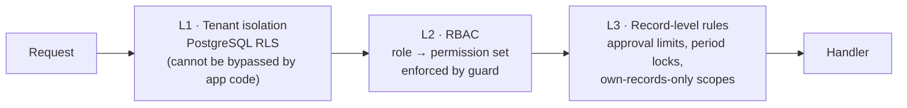

# 4. Data Security & Compliance

Accounting data is a high-value target: it contains bank details, customer lists, pricing, salaries, and the full financial position of every tenant. A breach is not a bug — it is an existential event for a young accounting SaaS. This document covers the controls that must exist before the first paying customer, and the ones that can follow.

---

## 4.1 Encryption

### In transit
- **TLS 1.3 only** at the edge; TLS 1.2 permitted only if a specific bank or gateway partner requires it, and then only on that egress path.
- **HSTS** with `max-age=31536000; includeSubDomains; preload`.
- Internal service-to-service traffic uses **mTLS** inside the VPC. "Private network" is not a substitute for encryption.
- Database connections require TLS with certificate verification (`sslmode=verify-full`).
- **Certificate pinning** for the MyInvois and payment-gateway egress paths — these are the connections where a MITM is worth an attacker's effort.

### At rest
- Disk-level encryption via **KMS-managed keys** on RDS, EBS, S3, and backups (AES-256). This is table stakes and satisfies the compliance checkbox, but it only protects against physical media loss.
- **Application-level field encryption** for the fields that actually hurt, using envelope encryption with a per-tenant data key wrapped by a KMS master key:

  | Field | Treatment |
  | --- | --- |
  | Bank account numbers | Encrypted; display masked (`****4521`) |
  | NRIC / passport numbers | Encrypted; masked in all list views |
  | Payment gateway credentials, API keys for integrations | Encrypted; never returned by any read API |
  | Uploaded bank statements and receipts | S3 SSE-KMS with the tenant data key |
  | OCR extraction payloads | Encrypted (they contain full document contents) |

- **Per-tenant data keys** mean a key can be destroyed to cryptographically erase one tenant — which is how you satisfy a PDPA erasure request without deleting rows the ledger's integrity depends on.
- Key rotation: KMS master key annually, data keys on tenant offboarding, immediate rotation on any suspected compromise.
- **Passwords:** Argon2id (`m=64MiB, t=3, p=4`), never SHA/bcrypt-with-low-cost. API keys and refresh tokens stored as SHA-256 hashes; the plaintext is shown once at creation and never again.

---

## 4.2 Access control

### Authentication
- Argon2id password hashing; breached-password check against a k-anonymised HIBP lookup at registration and change.
- **TOTP MFA mandatory** for `Owner`, `Admin`, and `Accountant` roles; strongly prompted for everyone else. WebAuthn/passkeys as the next step — offer it before it is demanded.
- Access tokens: **10-minute** lifetime, in memory only, never in `localStorage`.
- Refresh tokens: HttpOnly + Secure + SameSite cookie, rotated on every use with **reuse detection** — a replayed refresh token invalidates the entire session family and alerts the user.
- **Step-up authentication** (re-enter password or MFA) required for: changing bank details, adding a payment gateway, locking or unlocking a period, changing a user's role, exporting the full dataset, deleting an organisation.
- Account lockout with exponential backoff; anomalous-login alerts (new device, new country, impossible travel) sent to the account email.

### Authorisation — defence in depth, three independent layers



Layer 1 is the one that matters most, because it is the only layer an application bug cannot defeat. Layers 2 and 3 protect against misuse by legitimate users; layer 1 protects against your own code.

**Role matrix (MVP):**

| Permission | Owner | Admin | Accountant | Bookkeeper | Sales | Approver | Read-only | Auditor |
| --- | :-: | :-: | :-: | :-: | :-: | :-: | :-: | :-: |
| View reports | ✅ | ✅ | ✅ | ✅ | — | ✅ | ✅ | ✅ |
| Create/edit invoices | ✅ | ✅ | ✅ | ✅ | ✅ | — | — | — |
| Approve bills | ✅ | ✅ | ✅ | — | — | ✅ | — | — |
| Post manual journals | ✅ | ✅ | ✅ | — | — | — | — | — |
| Reconcile bank | ✅ | ✅ | ✅ | ✅ | — | — | — | — |
| Lock/close period | ✅ | ✅ | ✅ | — | — | — | — | — |
| Manage users & roles | ✅ | ✅ | — | — | — | — | — | — |
| Change bank details | ✅ | ✅ | — | — | — | — | — | — |
| Export full dataset | ✅ | ✅ | ✅ | — | — | — | — | ✅ |
| Delete organisation | ✅ | — | — | — | — | — | — | — |

**Separation of duties** is a control accountants will look for: the user who creates a bill should not be the only approver (configurable threshold, on by default above RM10,000), and the user who enters a payment should ideally not be the one who reconciles it. Enforce as warnings in MVP, hard rules as a paid-tier control.

**External Auditor** deserves special handling: time-boxed access (default 30 days, auto-expiring), read-only at the database-role level, every view logged, and the tenant owner gets a summary of what the auditor accessed. This is a feature accountants will actively ask for.

---

## 4.3 Audit logging

Two logs, deliberately separate.

**1. Technical audit log** — every mutation across every table.

```
tenant_id · actor_user_id · actor_ip · user_agent · request_id · session_id
action (CREATE|UPDATE|DELETE|LOGIN|EXPORT|...) · entity_type · entity_id
before_json · after_json · occurred_at · prev_hash · row_hash
```

- **Append-only, enforced in the database.** A trigger raises on `UPDATE`/`DELETE`. The application role has `INSERT` and `SELECT` grants only.
- **Written by a trigger, not by the services.** `audit_row_change()` is installed on every tenant-owned table (migration 0016). An application-level helper would be forgettable by the next write path and, more importantly, blind to a write that never went through the application — which is the write an audit log most needs to catch.
- **Hash-chained:** `row_hash = SHA256(canonical_jsonb(prev_hash, tenant, actor, ip, user_agent, request_id, action, entity, before, after, occurred_at))`. Rendered through `jsonb` and with the timestamp explicitly formatted at UTC, because a plain concatenation of `timestamptz::text` renders in the *session's* timezone and is therefore not reproducible — and because concatenation without delimiters lets adjacent fields collide. The attribution columns are inside the hash; the original formula omitted them, which left "which machine did this" freely editable.
- **Verification recomputes, it does not merely re-link.** Checking only that each `prev_hash` matches the previous row's stored `row_hash` detects an inserted or deleted row and misses a row *edited in place* entirely, because the stored hash is never challenged. `verify_audit_chain()` recomputes each row's hash from its own columns and reports `CONTENT_ALTERED` separately from `CHAIN_BROKEN`.
- **Ordering.** A chain is inherently sequential, so the insert trigger takes a per-tenant advisory lock. That lock must be acquired *before* any document-number lock or the two deadlock — `allocate_document_number()` takes it first, and that ordering is the rule the whole scheme depends on.
- **What it is not.** This detects tampering by anyone who did not also re-chain every subsequent row. It does not defend against an attacker with owner rights who does, and nothing held in the same database could. The independent anchor below is what closes that gap, and it is **not implemented**.
- Ship the daily chain head to append-only storage (S3 Object Lock) for an independent anchor.
- **Not covered:** `app_user` and `user_session` are global and have no `tenant_id`, so password changes, lockouts and session revocations fall outside a tenant-scoped log. They need a separate global security event log.
- Retention: **7 years**, matching Malaysian statutory record-keeping requirements. Archive to cold storage after 12 months, but keep it queryable.

**2. Financial event log** — the small, high-signal set an auditor actually asks about:

period lock/unlock · backdated posting · journal reversal · bank account detail change · user role change · approval threshold override · full data export · e-invoice cancellation · opening balance adjustment · chart of accounts change on an account with a non-zero balance.

Keeping this separate means the auditor's report is a 200-row list, not a 4-million-row haystack. It is also what you surface in the UI as "Compliance activity".

**Immutability of the ledger itself** is the third pillar and belongs here: posted journal entries cannot be updated or deleted (DB trigger), corrections are reversing entries, and voiding a document creates a reversal rather than a delete. Anyone evaluating the product technically will test exactly this.

---

## 4.4 Application security

| Threat | Control |
| --- | --- |
| SQL injection | Parameterised queries only; a lint rule bans string interpolation into SQL; raw reporting SQL reviewed and parameterised |
| XSS | React escaping by default, strict CSP (`default-src 'self'`, no `unsafe-inline`, nonce-based scripts), DOMPurify on any HTML template preview |
| CSRF | SameSite cookies + double-submit token on state-changing routes |
| IDOR | RLS makes cross-tenant IDOR structurally impossible; within-tenant record scoping enforced in the service layer and covered by tests |
| Mass assignment | Zod schemas with `.strict()` — unknown keys rejected, not silently ignored |
| SSRF | Egress allowlist; user-supplied URLs (webhooks, logo fetch) resolved and validated against a private-IP denylist before request |
| File upload | Type sniffing (not extension trust), size caps, ClamAV scan, stored outside the web root, served only via short-lived pre-signed URLs, `Content-Disposition: attachment` |
| Rate limiting | Per-IP, per-user, per-tenant; strict limits on auth, export, and the public pay-link endpoints |
| Dependency risk | Renovate for updates, `npm audit` + Snyk in CI, SBOM generated per release, lockfile integrity enforced |
| Secrets in code | gitleaks pre-commit hook and CI gate |
| Insider risk | Production DB access requires break-glass approval, is time-bounded, session-recorded, and alerts the security channel |

**Idempotency and concurrency** are security controls in a financial system, not just correctness ones:
- Every financial `POST` accepts an `Idempotency-Key`; the response is stored and replayed for 24 hours. A double-clicked "Record payment" must not create two payments.
- Optimistic concurrency via a `version` column on mutable documents; a stale write returns `409` rather than silently clobbering a colleague's edit.
- Gapless document numbering via advisory lock — auditors treat a gap in invoice numbers as a red flag, so sequence allocation must not use a rollback-prone `SEQUENCE`.

---

## 4.5 Malaysian regulatory compliance

### PDPA 2010 (as amended, including the 2024 amendments)

| Obligation | Implementation |
| --- | --- |
| Lawful processing & consent | Consent records with timestamp, version, and scope; granular marketing opt-in kept separate from service communications |
| Data subject access | Self-service export of a contact's personal data; a documented DSAR workflow with a tracked response deadline |
| Correction | Editable contact records with a full change history |
| Erasure | **Crypto-erasure** of the per-tenant/per-subject encrypted fields plus pseudonymisation of identifiers, while the ledger entries themselves are retained under the statutory record-keeping exemption. Document this reasoning — "we cannot delete because accounting" is only defensible if you show what you *did* do. |
| Retention limitation | Documented retention schedule; automated purge of data past its window (soft-deleted tenants after 90 days, unverified signups after 30) |
| Security principle | The controls in §4.1–4.4 |
| Breach notification | Documented IR plan with the regulator/data-subject notification path and timeline; tested annually |
| Data Protection Officer | Appointed, named in the privacy policy, reachable |
| Cross-border transfer | Malaysian region primary; any processor outside MY documented in the processing register with a transfer basis |

### Financial record keeping
- **7-year retention** of accounting records and supporting documents (Income Tax Act / Companies Act) — this is the floor for the retention policy and it overrides "delete on request" for ledger data.
- Records must be reproducible in a readable form on demand: the `ReportSnapshot` and immutable PDF archive exist for exactly this.
- LHDN e-Invoice records (submitted payload, LHDN UUID, validation result) retained with the same 7-year horizon.

### Sub-processor & vendor management
Maintain a register of every sub-processor (AWS, Cloudflare, Sentry, SES, Textract, payment gateway) with data categories, region, and transfer basis. Customers on the accountant-firm side will ask for this during procurement; having it ready is a sales accelerator, and assembling it retroactively is miserable.

### Certification roadmap
- **Pre-launch:** independent penetration test, remediation, and a public security page.
- **Year 1:** ISO 27001 or SOC 2 Type I. Both are credibility purchases as much as security ones — accountant firms referring clients will ask.
- **Year 2:** SOC 2 Type II; annual pen test; a bug bounty once the surface has stabilised.

---

## 4.6 Business continuity

| Control | Target |
| --- | --- |
| Backups | Daily automated snapshot + PITR, **RPO 5 minutes** |
| Backup encryption | KMS, with a separate key from the production database key |
| Cross-region copy | Singapore, encrypted |
| Restore drill | **Quarterly**, timed, with the actual achieved RTO recorded |
| DR failover | **RTO 4 hours**, documented runbook, rehearsed |
| Ledger integrity check | Nightly recomputation of rollups from raw journal lines; drift pages on-call |
| Tenant data export | Self-service full export in open formats — the anti-lock-in promise *and* the customer's own continuity plan |

The quarterly restore drill is the control most often skipped and the one most likely to matter. Put it on a calendar with a named owner before launch, not after.
