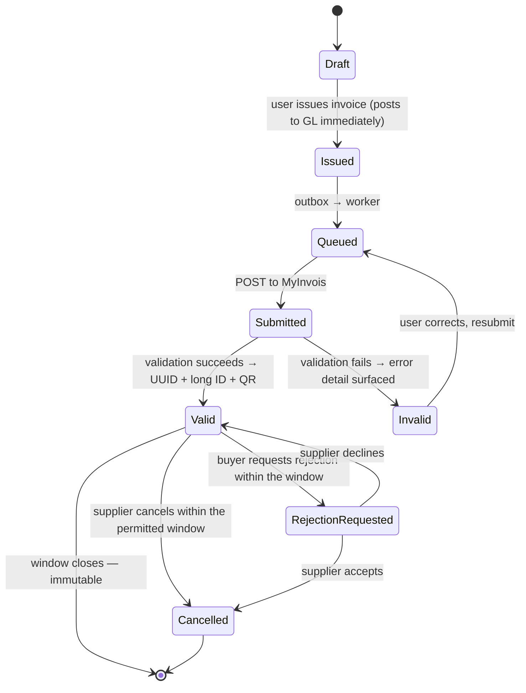

# 5. Malaysian Localisation

> ⚠️ **Verify before implementing.** Every rate, threshold, format and endpoint in this document must be confirmed against primary sources (LHDN/IRBM, RMCD, SSM, BNM, PayNet) at implementation time. Malaysian tax and e-invoicing rules have changed repeatedly and will change again. **Design rule: none of these values may be hardcoded.** They live in versioned, effective-dated configuration tables so a regulatory change is a data update, not a release.

This is the differentiator. Xero and QuickBooks treat Malaysia as a locale; Emil treats it as the domain.

---

## 5.1 LHDN e-Invoice (MyInvois)

### Why it is the wedge
The e-Invoice mandate is being phased in by annual-turnover band, reaching small businesses last. Every SME in the country needs a compliant issuing path, most incumbent local software (SQL Account, AutoCount, UBS) is desktop-first, and the global players integrate slowly and generically. A product that makes e-Invoice *invisible* — issue an invoice, compliance just happens — wins on the strength of that alone.

**Rollout phasing** is by annual turnover, staged from the largest taxpayers downward, with the smallest bands last and a turnover floor below which businesses are exempt. Confirm the current band dates and the exemption floor with LHDN before building the onboarding logic, and store them as data: the tenant's phase should be *derived* from its declared turnover against a rules table, so the wizard stays correct when the schedule shifts again.

### Document types to support

| Type | Notes |
| --- | --- |
| Invoice | Standard B2B/B2G sales document |
| Credit note | Reduction against a validated invoice |
| Debit note | Increase against a validated invoice |
| Refund note | Refund of a payment |
| Self-billed invoice / CN / DN / refund | Buyer issues on the supplier's behalf — required for foreign suppliers, imported services, and other specified categories. **This is the case most products get wrong.** |
| Consolidated invoice | Aggregated B2C activity for buyers who do not request an individual e-invoice, submitted per period within the prescribed window after month end |

### Submission lifecycle

**The non-negotiable design points:**

1. **Issuance is never blocked by LHDN availability.** The invoice posts to the ledger and is issued to the customer regardless; submission is an async side effect via the transactional outbox. A gateway outage must not stop a business from invoicing.
2. **The cancellation/rejection window is a deadline, and the UI must show it.** A countdown on the invoice ("cancellable for another 47 hours") is the kind of detail that makes accountants trust the product. After the window, the only correction path is a credit note.
3. **Store the exact payload that was sent**, hashed and immutable. When LHDN and your records disagree three years later, the payload is the evidence.
4. **Validation before submission, not after.** Run the full field-level validation locally (TIN format, required fields, classification codes, tax totals, rounding) and show errors at the point of issue. A rejection that arrives asynchronously two minutes later is a terrible user experience.
5. **Degraded mode is a first-class state.** Circuit breaker on repeated failures, queue depth visible on an ops dashboard, bulk retry available, and a clear in-app banner telling users their invoices are queued rather than lost.

### Required data you must capture upstream
This is where the architecture bites: MyInvois requires fields that a generic invoice model does not have. Capture them at contact and item creation, not at submission time.

- **Supplier and buyer TIN**, plus a secondary identifier (SSM/BRN for companies, NRIC/passport/army number for individuals) and the identifier *type*
- **MSIC code** and business activity description for the supplier
- **SST registration number** where applicable
- **Classification code per line item** — a per-item default with an override, plus a searchable picker, because asking a user to look up a code on every line will make them abandon the product
- Full structured addresses (state code, postcode, country code — not a free-text blob)
- Currency and exchange rate where not MYR
- Payment mode and terms

**Design consequence:** `Contact` and `Item` carry a validation state. An invoice to a contact missing a TIN cannot be submitted, so the UI must warn *at contact creation*, not at issue time.

---

## 5.2 SST — Sales & Service Tax

Malaysia replaced GST with SST in 2018. SST is **two separate taxes**, and conflating them is the most common modelling error:

| | Sales Tax | Service Tax |
| --- | --- | --- |
| Levied on | Taxable goods manufactured locally or imported | Prescribed taxable services |
| Charged by | Registered manufacturers / importers | Registered service providers |
| Point | Single-stage, at manufacture/import | On provision of the prescribed service |
| Recovery | Generally **not** creditable down the chain | Generally **not** creditable; B2B exemptions exist for specified intra-group/same-service cases |

**Modelling implications:**

1. **SST is not a VAT.** Do not build a GST-style input/output credit engine and rename the accounts. Input SST is usually a *cost* absorbed into the expense or asset, not a recoverable receivable. Getting this wrong misstates both the P&L and the balance sheet for every Malaysian customer.
2. **Multiple rates coexist**, and services and goods sit on different rate schedules, with some service categories on a lower rate than others and a long list of exemptions and exempted registrant categories. Model as `TaxCode → TaxRateVersion(valid_from, valid_to)` and never as an enum.
3. **Scope has been expanded and rates revised more than once since 2018.** Historic documents must reprint at the rate that applied on their tax point — hence `tax_point_date` on `TaxTransaction`, and hence the immutable `TaxTransaction` evidence table rather than recomputing tax from current rates at report time.
4. **Registration threshold** determines whether a tenant charges SST at all. Capture it in onboarding; if the tenant is not registered, hide SST fields entirely rather than showing them at 0% — the clutter is a real usability cost for the many SMEs below the threshold.
5. **Exemption certificates** are per-customer with validity windows, and must be evidenced on the invoice.
6. **SST-02 return preparation** with drill-down from every box to contributing transactions. The drill-down is the feature; the summary is table stakes.

**Also model:** withholding tax on payments to non-residents (rates vary by payment type — royalties, technical fees, interest, contract payments — and by treaty), tracked per payment for the CP37 series and reflected as a liability until remitted.

---

## 5.3 Payments & bank rails

### Collection (money in)
| Rail | Notes |
| --- | --- |
| **FPX** | The dominant Malaysian online payment method — direct bank debit via PayNet. Non-negotiable. Access via a local gateway (Billplz, iPay88, senangPay, Curlec) rather than direct PayNet membership at MVP. |
| **DuitNow QR** | Ubiquitous. Generate a per-invoice QR on the PDF and the pay page; reconciliation matches on the payment reference. |
| **DuitNow Transfer (to account/ID)** | Customers pay by bank transfer to an account, phone number, or business registration number. This is why the reference-extraction part of the matching engine matters so much. |
| **Cards** | Local acquiring via the gateway; Stripe for international customers. |
| **Cheque / cash** | Still real in Malaysian SME trade. Support undeposited-funds handling properly. |

### Disbursement (money out)
Bulk payment file export in each major bank's business-banking format (Maybank2u Biz, CIMB BizChannel, Public Bank PBe, RHB Reflex) — the SME workflow is "export a payment file, upload it to the bank portal, approve there". Building this saves customers hours per month and is a strong retention feature.

### Bank statement ingest
Malaysia has no broad, production-grade open-banking API for SME account access yet — PayNet's open API framework is developing but you cannot build the MVP on it.

**Therefore: import-first, feeds-as-adapter.**
- Ship **CSV mapping profiles** for the major banks (Maybank, CIMB, Public Bank, RHB, Hong Leong, Bank Islam, AmBank, OCBC, HSBC, UOB, Alliance) plus a generic mapper with a preview-and-confirm step.
- Support **MT940** and **OFX/QIF** for banks that offer them.
- PDF-statement parsing as a convenience path, always with a human review step — never post directly from a parsed PDF.
- Define a `BankFeedProvider` interface now so a real feed slots in without touching the reconciliation workspace.

Handle the practical details that break naive importers: dual debit/credit columns vs a single signed column, `DD/MM/YYYY` (Malaysian convention, and a trap for anyone assuming US ordering), thousands separators, trailing `CR`/`DR` markers, multi-line descriptions, and running-balance columns that let you validate the import arithmetically.

---

## 5.4 Statutory & reporting context

| Item | Implication |
| --- | --- |
| **MPERS** (private entities) vs **MFRS** (public interest entities) | Different statement presentation and disclosure. Tenant declares its framework at onboarding; `ReportDefinition` drives the layout. Most SME customers are MPERS. |
| **SSM** (Companies Commission) | Registration number format changed to a 12-digit format; validate both legacy and current formats. Annual return and financial statement filing obligations create a natural product hook. |
| **Financial year end** | Malaysian SMEs commonly use a non-December FYE. Never assume a calendar year anywhere in period logic. |
| **Income tax filing** | Form C (companies), Form B/BE (individuals/sole traders), CP204 tax estimates. Producing a tax-computation-ready export is a strong v1.1 feature. |
| **Statutory payroll** | EPF, SOCSO, EIS, PCB/MTD, HRDF. Deferred from MVP — it is a product in itself — but the CoA templates should already include the correct liability accounts so the later module drops in cleanly. |
| **e-Invoice + SST interaction** | Tax amounts on the e-invoice must agree exactly with the ledger's tax postings. A single rounding-policy definition, shared by the tax engine, the PDF, and the UBL payload, prevents an entire class of rejection. |

---

## 5.5 Language, formatting and conventions

| Aspect | Decision |
| --- | --- |
| Currency | **MYR** default. Display `RM 1,234.56`. Symbol before amount, no space in compact contexts, two decimals. Store `NUMERIC(19,4)`; the extra two places matter for unit prices and FX. |
| Number formatting | Comma thousands separator, period decimal — `1,234,567.89` |
| Date format | `DD/MM/YYYY` for display and CSV import defaults. **This is the single most common localisation bug** — an American developer's date parser will silently mangle 03/04/2026. Parse with an explicit format, never with `new Date(string)`. |
| Timezone | `Asia/Kuala_Lumpur` (UTC+8), no DST. Store UTC, render local. Accounting *dates* (invoice date, tax point) are calendar dates with no timezone — model them as `DATE`, not `TIMESTAMP`, or you will get off-by-one-day errors at period boundaries. |
| Language | English (en-MY) primary — the business language of Malaysian accounting. Bahasa Malaysia second, Simplified Chinese third. Build i18n in from day one. |
| Number-to-words | Required on some documents: "Ringgit Malaysia One Thousand Two Hundred Thirty Four and Sen Fifty Six Only". Support English and BM. |
| Business hours | Note that the working week differs in Johor, Kedah, Kelantan and Terengganu (Fri–Sat weekend). Relevant to due-date and reminder-scheduling logic. |
| Public holidays | Federal plus state-specific holidays affect payment-due-date calculations and reminder scheduling. Maintain a holiday calendar per state. |

---

## 5.6 Competitive positioning

| Competitor | Weakness Emil should exploit |
| --- | --- |
| **Xero** | Generic locale support; e-Invoice handled shallowly or via third-party middleware; no FPX-native collections; priced in a foreign currency. |
| **QuickBooks** | Thin Malaysian presence; GST-shaped tax engine awkwardly adapted to SST. |
| **SQL Account / AutoCount / UBS** | Strong local compliance and accountant trust, but desktop-first, weak multi-user cloud story, dated UX, per-seat licensing. |
| **Zoho Books** | Good value, decent localisation, but a generalist suite — accounting is one product among forty. |

**The positioning that follows:** *cloud-native like Xero, compliant like SQL Account, priced in RM.* The three features that prove it are (1) e-Invoice that just works, (2) SST modelled correctly rather than as a renamed VAT, and (3) bank reconciliation that handles real Malaysian bank exports without the user fighting a CSV mapper.
